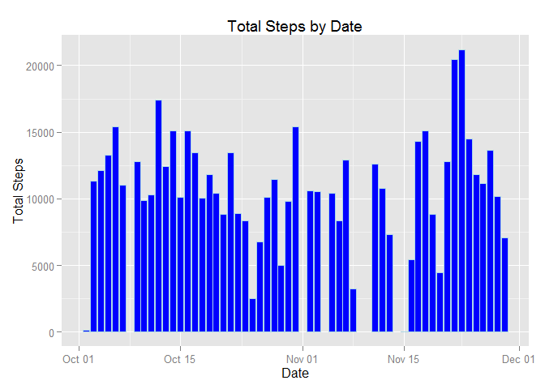
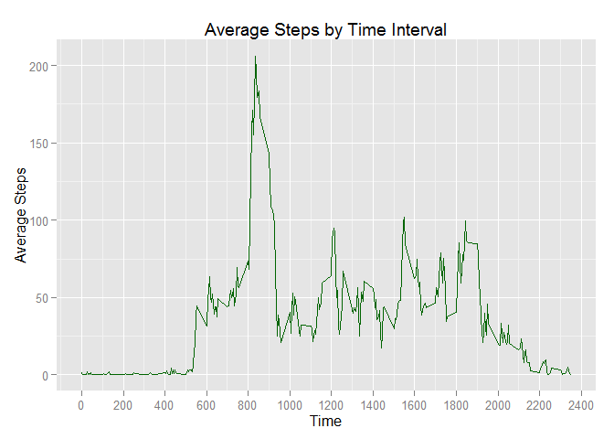
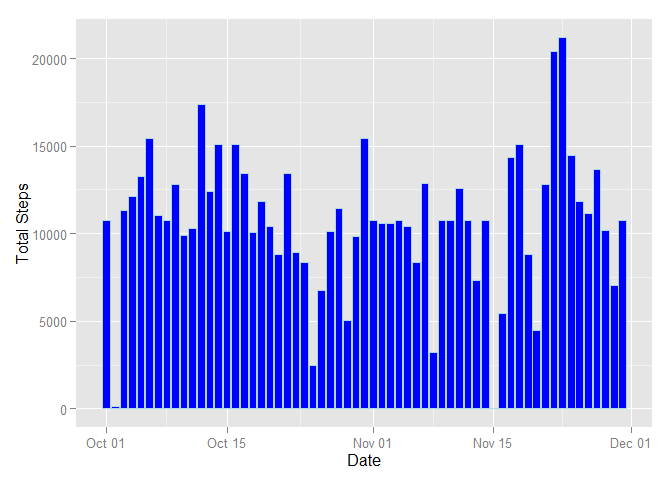
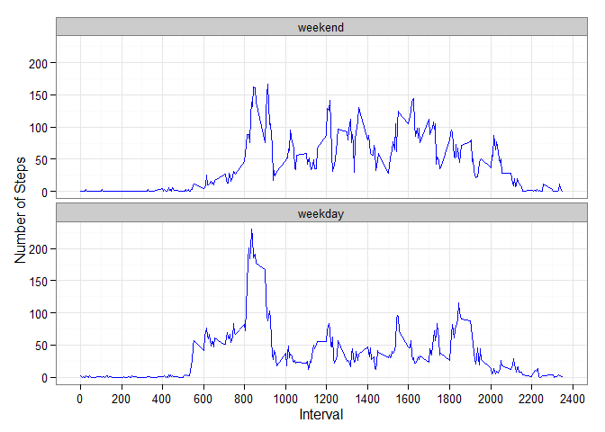

# Reproducible Research: Peer Assessment 1


## Loading and preprocessing the data

To prepare the data we read the csv file and converted the date column to be of type date.

Here we also loaded the ggplot2 library to prepare the plots for the later parts of the assessment.


```r
# Load required libraries
library(ggplot2)

# Read in data from the activity.csv file.
# The file is assumed to be in the current working directory
activity <- read.csv("activity.csv", stringsAsFactors = FALSE)

# Convert date column to date type
activity$date <- as.Date(activity$date,"%Y-%m-%d")
```

## What is mean total number of steps taken per day?

Here we aggregated the data by date, then produced a histogram showing the steps for each day.

We also calculated the mean and median of the daily total steps.


```r
# Produce sum of steps by date
activityByDate <- aggregate(activity['steps'], by=list(activity$date), FUN=sum)
colnames(activityByDate) <- c('Date','TotalSteps')

# Plot histogram of total steps by date
totalStepsHist <- ggplot(data = activityByDate,
                         aes(activityByDate$Date,activityByDate$TotalSteps))
totalStepsHist <- totalStepsHist + geom_histogram(stat="identity", color="lightblue",fill="blue")
totalStepsHist <- totalStepsHist + xlab("Date") + ylab("Total Steps")
totalStepsHist <- totalStepsHist + ggtitle("Total Steps by Date")
print(totalStepsHist)
```

```
## Warning: Removed 8 rows containing missing values (position_stack).
```

 

```r
# Calculate mean and median
meanSteps <- mean(activityByDate$TotalSteps,na.rm = TRUE)
medianSteps <- median(activityByDate$TotalSteps,na.rm = TRUE)
```

The mean daily total steps is 10766.19.  
The median daily total steps is 10765.

## What is the average daily activity pattern?

To calculate the daily activity pattern we aggregated by time interval and produced a line graph to show this.


```r
# Produce average of steps by time interval
activityByInterval <- aggregate(activity['steps'], 
                                by=list(activity$interval), 
                                FUN=mean, 
                                na.rm=TRUE)
colnames(activityByInterval) <- c('TimeInterval','MeanSteps')

# Plot time series
meanStepsPlot <- ggplot(data = activityByInterval,
                        aes(activityByInterval$TimeInterval,activityByInterval$MeanSteps))
meanStepsPlot <- meanStepsPlot + geom_line(color="darkgreen")
meanStepsPlot <- meanStepsPlot + scale_x_continuous(breaks=seq(0,2400,by=200))
meanStepsPlot <- meanStepsPlot + xlab("Time") + ylab("Average Steps")
meanStepsPlot <- meanStepsPlot + ggtitle("Average Steps by Time Interval")
print(meanStepsPlot)
```

 

```r
maxSteps <- subset(activityByInterval,
                   activityByInterval$MeanSteps == max(activityByInterval$MeanSteps))
```

The time interval that had the most steps on average was 835.

## Imputing missing values


```r
# Count the number of missing values
activitiesWithNA <- subset(activity,is.na(activity$steps))
numberOfMissingValues <- length(activitiesWithNA$steps)
```

There are 2304 values missing from this data set.

To impute the missing values, we took the average value of steps for the corresponding time interval.


```r
# Fill missing values with the average for that time interval
filledActivity <- activity

for (activityRow in row(filledActivity)) {
      if (is.na(filledActivity[activityRow,'steps'])) {
            filledActivity[activityRow,'steps'] <- round(activityByInterval[(activityByInterval$TimeInterval == filledActivity[activityRow,'interval']),'MeanSteps'],0)
      }
}

# Produce sum of steps by date with missing values filled
filledActivityByDate <- aggregate(filledActivity['steps'], by=list(filledActivity$date), FUN=sum)
colnames(filledActivityByDate) <- c('Date','TotalSteps')

# Plot histogram of total steps by date
totalFilledStepsHist <- ggplot(data = filledActivityByDate,
                         aes(filledActivityByDate$Date,filledActivityByDate$TotalSteps))
totalFilledStepsHist <- totalFilledStepsHist + geom_histogram(stat="identity", color="lightblue",fill="blue")
totalFilledStepsHist <- totalFilledStepsHist + xlab("Date") + ylab("Total Steps")
totalSFilledtepsHist <- totalFilledStepsHist + ggtitle("Total Steps by Date - missing values filled")
print(totalFilledStepsHist)
```

 

```r
# Calculate mean and median
meanFilledSteps <- mean(filledActivityByDate$TotalSteps,na.rm = TRUE)
medianFilledSteps <- median(filledActivityByDate$TotalSteps,na.rm = TRUE)
```

Imputing the missing values changed the calculated mean from 10766.19 to 10765.64.  
The median changed from 10765 to 10762.

## Are there differences in activity patterns between weekdays and weekends?

To show the differences between weekday and weekend step patterns we created a new column in the dataset to show the type of day.  We then created a panel plot to show the pattern for each type of day.


```r
# Produce a factor with weekends and weekdays
weekendDays <- c("Saturday","Sunday")
filledActivity$dayType <- factor((weekdays(filledActivity$date) %in% weekendDays),
                                 levels = c(TRUE,FALSE),
                                 labels = c("weekend","weekday"))

# Aggregate by day type and interval
filledActivityByTypeAndInterval <- aggregate(filledActivity['steps'],
                                             by=list(filledActivity$interval, filledActivity$dayType), 
                                             FUN=mean, 
                                             na.rm=TRUE)
colnames(filledActivityByTypeAndInterval) <- c('TimeInterval', 'DayType', 'MeanSteps')

# Plot a time series for weekends and weekdays

dayTypePlot <- ggplot(data = filledActivityByTypeAndInterval,
                      aes(filledActivityByTypeAndInterval$TimeInterval,
                          filledActivityByTypeAndInterval$MeanSteps))
dayTypePlot <- dayTypePlot + geom_line(color="blue")
dayTypePlot <- dayTypePlot + theme_bw()
dayTypePlot <- dayTypePlot + facet_wrap(~DayType, ncol=1)
dayTypePlot <- dayTypePlot + xlab("Interval") + ylab("Number of Steps")
dayTypePlot <- dayTypePlot + scale_x_continuous(breaks=seq(0,2400,by=200))
print(dayTypePlot)
```

 

This shows a number of key differences between weekends and weekdays. Two in particular stand out:  
1. The peak that occurs around 830 on weekdays is substantially lower on weekends.  We could postulate that this may be because of the amount of walking done on weekdays to get to work at that time.  
2. There are generally more steps taken on weekends for the period 1000 to 1700.  We could hypothesise that this corresponds to time at work on weekdays, which involved more sitting than walking.  This time would then be more active at weekends where the subject had free time to pursue other interests.
